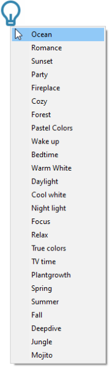

# Smart Bulb Control
Rainmeter skin for controlling smart light bulbs

## Requirements
- [Rainmeter](https://www.rainmeter.net/)
- [wizcon](https://github.com/rgomezjnr/wizcon)

## Installation
1. Install [Smart Bulb Control 0.2.0.rmskin](https://github.com/rgomezjnr/Smart-Bulb-Control/blob/master/Smart%20Bulb%20Control%200.2.0.rmskin) package
2. Set your bulb's IP address in [Smart Bulb Control.ini](https://github.com/rgomezjnr/Smart-Bulb-Control/blob/master/Smart%20Bulb%20Control.ini)
3. Refresh skin

## Usage
Left-click to toggle smart bulb on and off.

Right-click to select scene. A maximum of 25 scenes can be listed in the context menu.
Modify the scenes list as desired in [Smart Bulb Control.ini](https://github.com/rgomezjnr/Smart-Bulb-Control/blob/master/Smart%20Bulb%20Control.ini).

Scroll wheel up to increase brightness. Scroll wheel down to decrease brightness.

## Source code
https://github.com/rgomezjnr/Smart-Bulb-Control

## Author
[Robert Gomez, Jr.](https://github.com/rgomezjnr)

## Acknowledgement
Lightbulb icon from [Remix Icon](https://remixicon.com/)

## License
[MIT](https://github.com/rgomezjnr/Smart-Bulb-Control/blob/master/LICENSE.txt)
